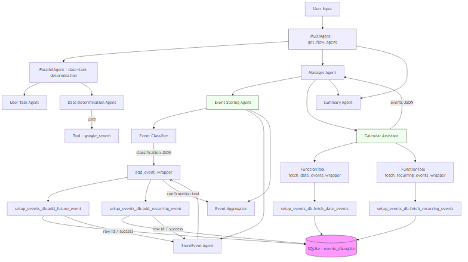

# DayPlannerAgent
This agent is created using google ADK and helps plan daily events .It can process text and store events. It can also fetch events using LLM text .e.g. I  have a yoga class at 6PM for next 15 days .How does my day looks for next two days.
The main flow has two sub flows one for storing and other for fetching .Agentic architecture navigates the flow.

## Architecture

The following diagram shows the high-level architecture and data flow from the top-level `MultiAgent` down to `CalendarAgent` and the persistence layer (`setup_events_db`).

	<picture>
		<source srcset="docs/diagrams/architecture.svg" type="image/svg+xml">
		
	</picture>

If your viewer does not render SVG, the PNG file will be used as a fallback. You can also open `docs/diagrams/architecture.mmd` in a Mermaid preview to edit or re-render the diagram locally.
